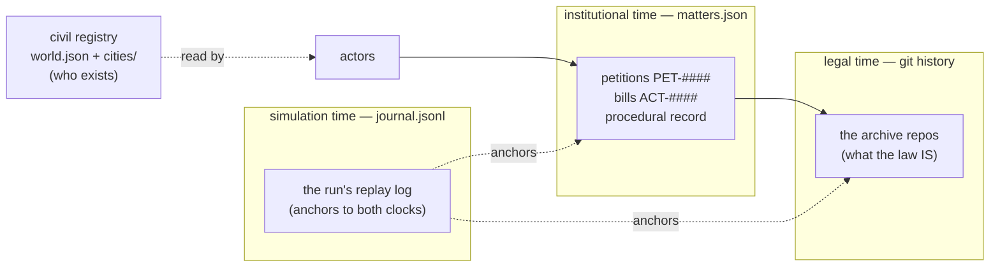
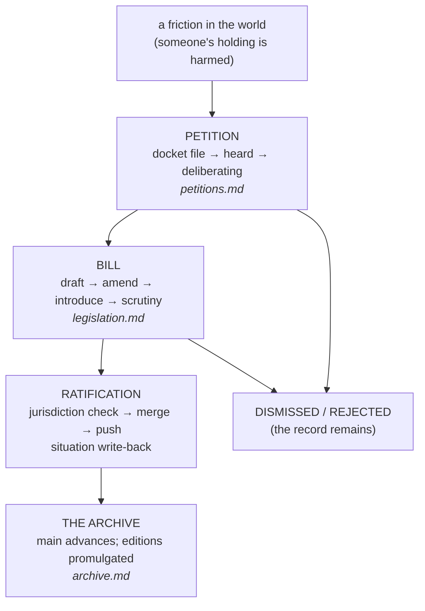

# Flows through the system — the master map

This set explains the legal order **in motion**: every way a norm, a
grievance, or an archive changes, and the exact polis commands that make
it happen. Read this master first, then the flow you care about.

| flow | document | one line |
|---|---|---|
| **Petitions** (the docket) | [petitions.md](petitions.md) | grievances enter, are heard, are answered or dismissed |
| **Legislation** (bills) | [legislation.md](legislation.md) | drafts become law through scrutiny and ratification |
| **The archive** (legal time) | [archive.md](archive.md) | the corpus is obtained, lodged, promulgated, exceptionally corrected |
| **The simulation** (epochs) | [simulation.md](simulation.md) | the director plays stories through all of the above |

For setup (requirements, provisioning, lifecycle), see
[../running-a-simulation.md](../running-a-simulation.md).

## The actors

- **Citizen-legislators** (political persons) file petitions, draft and
  introduce bills, speak in debates. They may never hold juridical office.
- **The Keeper of the Federal Rolls** (`e.vexley`, office
  `federal-archivist`, power `merge:main`) ratifies cross-city law; the
  **local archivists** ratify what stays inside `municipal/<their-city>/**`.
- **Council jurists** (three seats, rotation) give constitutional review.
- **Domain experts** (`expert-<domain>`) give jurisdictional review — only
  for jurisdictions with a federal corpus; fisheries has none, and the
  record says so.
- **The platforms** (gogs in phase 1) are *merely mechanical hosts* of the
  archive. They know git refs and nothing of petitions or approvals.

## Where the actors sit — execution contexts

Agency is not just claimed, it is containerized. A sim runs three kinds
of machines:

| container | whose machine | sees | can ratify |
|---|---|---|---|
| `<sim>-gogs` | the mechanical archive host | git refs only | — |
| `polis-operator-<sim>` | the orchestrator / director | all slices + federal offices (incl. the Keeper's) | cross-city law |
| `polis-city-<city>-<sim>` (**citynodes**) | one city's citizens | **only that city's slice** (legal data read-only) | municipal scope at most |

- Every sim gets the first two; the director and all host-proxied
  commands run through the operator.
- **Citynodes are optional** (`provision up --with-city-containers`) and
  `health` reports them as *warn*, not fail. They exist to make the
  isolation demonstrable (a citizen of Cogswich acts from inside
  Cogswich, with no sight of the federal machinery), for interactive
  "live in a city" sessions, and for the future ContainerExecutor —
  the director driving via `podman exec` into the cities instead of the
  operator.
- The Keeper's credentials never enter a city container — federal merge
  power stays with the orchestrator.

## The three stores — why nothing is "in the database"

- **git history** = the legal archive. Enactment is a merge into `main`.
- **`matters.json`** = the political state. Recording an event ≠ enforcing
  a procedure — the constitution is enforced by *people*, and jurisdiction
  checks run in the archivists' own tooling, never in the platform.
- **`journal.jsonl`** = the run's log; every entry anchors into the other
  two clocks (`main: be343ae → f3c7208`, `matter: ACT-0004`).
- **`world.json` + slices** = who exists and what they may do.

## The phases

The federation has two machinery phases, stored in `world.json`:

- **Phase 1 — customary** (gogs): petitions/bills are matter-store
  entries; ratification incorporates *locally* (`git merge FETCH_HEAD &&
  push`). The platform has no institutional concepts at all. Phase 1 is
  recorded **in the corpus itself**: `constitution/02-customary-machinery.md`
  (Article 3) is part of every sim's founding commit.
- **Phase 2 — codified** (gitea + CI): same command surface, but petitions
  are real issues/PRs and the Mechanical Magistrate checks forms. The
  transition itself is enacted through phase-1 machinery — three ratified
  bills: CODEOWNERS, branch protection, `.woodpecker.yml`. The acts and
  their instruments are authored in `data/world/legal/transition/`, and
  the story is the `phase_transition` template
  (`polis world templates show phase_transition`). Effecting it:
  `polis sim transition <run>` (task 0038) — the third ratification
  flips the federation to phase 2 via the ordinary channels (situation,
  registry, slices); from then on, docket/bill act on the platform
  directly (issues/PRs).

## The one end-to-end picture

A simulation epoch is this picture, repeated: the director finds the
frictions, casts the people, and plays the flows — see
[simulation.md](simulation.md).
