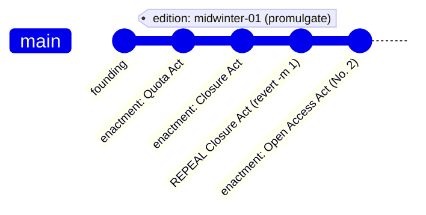

# Flow: the archive — legal time itself

The archive is git history, and its operators are archivists. Every
command here is a **git operation with a legal name** — this flow is the
isomorphism at its purest.

## Domain

- **obtain** — a city receives a complete copy of the archive
  (`git clone` + recognize the federal archive as `upstream`). The first
  act of any archivist.
- **receive** — federal enactments are brought into the city's copy
  (`git pull upstream main`).
- **lodge** — the city's archival acts are sent to its lodged copy
  (`git push`).
- **promulgate** — a named authoritative edition is proclaimed
  (`git tag`; Keeper only). Editions are how you cite "the law as it
  stood".
- **repeal** — an earlier act is undone, *the original remaining in the
  record* (`git revert -m 1`; Keeper only). Because enactment is a single
  merge commit, one revert undoes it whole.
- **transplant** — one act imported without its history
  (`git cherry-pick`).
- **reconstruct** — the current line replayed on a new foundation
  (`git rebase`).
- **replace-history** — the recognized record is replaced
  (`git push --force`, §15) — exceptional; requires `--yes`.

Two repeals exist *deliberately*: `archive repeal` is the Keeper's
exceptional correction; repeal-as-bill
(`bill draft --kind repeal …`) is the ordinary legislative road.



History only grows. Repeal adds; nothing erases — that is what makes the
archive a *legal* record rather than merely a file store.

## Commands

```bash
# read-only — no identity, resolved from context (sim or dev rig)
uv run polis archive editions          # the proclaimed editions (tags)
uv run polis archive inspect --limit 20  # recent genealogy of main

# the archivist's acts (need a person holding the office)
uv run polis archive obtain   --as e.vexley --city cogswich
uv run polis archive receive  --as e.vexley --city cogswich
uv run polis archive lodge    --as e.vexley --city cogswich
uv run polis archive promulgate --as e.vexley --city cogswich --name midwinter-01
uv run polis archive repeal <merge-commit> --as e.vexley --city cogswich --mainline 1
```

## Where it lives

- The archive repo is `<sim>-archive/common-law` (upstream); each city
  holds `<sim>-<city>/common-law` (origin). All share the one founding
  commit — histories are related, so enactment pushes are fast-forward.
- The Keeper's credentials stay with the operator/orchestrator; city
  containers never hold federal merge power.
- Jurisdiction by path: `constitution/`, domain dirs, `municipal/<city>/`
  — archivists' merge powers pattern-match these paths
  (`merge:municipal/cogswich/**` vs the Keeper's `merge:main`).
- Code: `polis/legislation/archive.py`; the powers come from offices in
  `world.json` (`_merge_powers` in `bill.py`).
