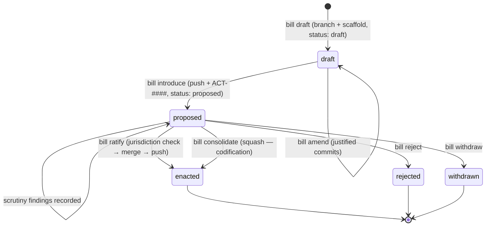
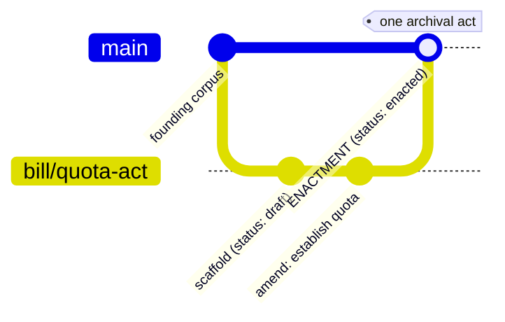

# Flow: legislation — a bill becomes law

The bill flow is where the three clocks meet: git (legal time) carries
the text and its incorporation; `matters.json` (institutional time)
carries the procedure; the journal (simulation time) anchors both.

## Domain

A bill begins as a **draft** on a branch — a document scaffolded from a
template into a jurisdictional path (`fisheries/`, `taxation/`, or
`municipal/<city>/`), with `status: draft`. It is **amended** (commits
with justifications), then **introduced**: lodged and petitioned for
incorporation — the machinery flips `status: proposed`, pushes the
branch, and opens the bill's matter (`ACT-####`), usually *answering* a
petition.

Then **scrutiny**, in two kinds:

- **jurisdictional** — the domain expert, *iff* the jurisdiction has a
  federal corpus (fisheries doesn't; the record says why it was skipped);
- **constitutional** — a Council jurist (the director rotates seats).

**Ratification** is the jurisdictional act: the archivist checks that
every amended path lies within their authority (the Keeper's
`merge:main` covers everything; a local archivist only
`municipal/<city>/**` — anything else is *ultra vires*), then
incorporates: **one archival act** — merge `--no-commit`, the status
flip to `enacted`, a single merge commit, push. Because it is one
commit, `archive repeal` can undo the enactment whole (revert `-m 1`).

**Where enactment is lodged** follows the ratifier's powers: the Keeper
enacts into the **federal archive** (upstream); a local archivist —
whose powers are municipal-only — enacts into the **city's own archive**
(origin). Municipal law is made at home:

```bash
# inside polis-city-brasshaven-<sim> (or from the host with the city's
# slice): a fully municipal flow
polis docket file --as m.grimshaw --title "The tide washes over the market steps"
polis bill draft --as m.grimshaw --title "Market Steps Sea Wall Act" \
  --kind act --into municipal/brasshaven
polis bill amend bill/market-steps-sea-wall-act --as m.grimshaw \
  --file municipal/brasshaven/market-steps-sea-wall-act.md --justification "…"
polis bill introduce bill/market-steps-sea-wall-act --as m.grimshaw \
  --title "Market Steps Sea Wall Act" --answering PET-0001
polis bill ratify bill/market-steps-sea-wall-act --as e.fallowfield
# → the enactment merge is in <sim>-brasshaven/common-law, NOT in the
#   federal archive (verified: the archive carries no trace of it)
```

The alternatives: **reject** (the petition fails, unmerged) or
**withdraw**; and **consolidate** — codify a messy process into one
coherent act (squash).

## The lifecycle





## Commands

```bash
# draft into a jurisdictional dir (act | amendment | repeal)
uv run polis bill draft --as m.grimsbane --city cogswich \
  --title "Northern Banks Quota Act" --kind act --into fisheries

# amend with justification (files relative to the corpus)
uv run polis bill amend bill/northern-banks-quota-act \
  --as m.grimsbane --city cogswich \
  --file fisheries/northern-banks-quota-act.md \
  --justification "Establish a quota, answering PET-0001"

# introduce — answers the petition, opens ACT-####
uv run polis bill introduce bill/northern-banks-quota-act \
  --as m.grimsbane --city cogswich \
  --title "Northern Banks Quota Act" --answering PET-0001

# scrutiny (constitutional review; jurisdictional when an expert exists)
uv run polis bill scrutinize bill/northern-banks-quota-act \
  --as b.grimsbane --city hushpoole --verdict approve \
  --body "Compatible with the common law."
# (the Council jurists: b.grimsbane→hushpoole, a.yarborough→chimefall,
#  m.featherstone→vapourmouth — the pair must match the registry)

# ratify — the Keeper (or a local archivist for municipal-only bills)
uv run polis bill ratify bill/northern-banks-quota-act \
  --as e.vexley --city cogswich

# read-only (no identity needed)
uv run polis bill list --state all
```

Every one of these accepts `--isomorphism` to render the Plan — e.g.
ratify shows the fetch, the jurisdiction check ("does every amended path
lie within the archivist's authority?") and the incorporation step
before a single git command runs.

## Where it lives

- Branch + merge: the petitioner's city repo (origin) and the archive
  (upstream). Ratify fetches `main` from upstream **first**, then the
  bill branch from origin — order matters (`FETCH_HEAD` semantics).
- Procedure: the bill's matter in `matters.json` (`proposed → enacted`).
- Corpus layout encodes jurisdiction: `constitution/`, domain dirs,
  `municipal/<city>/` — the `_check_jurisdiction` patterns match it.
- Code: `polis/legislation/bill.py`, `documents.py` (status flips),
  `templates/*.md` (scaffolds).
