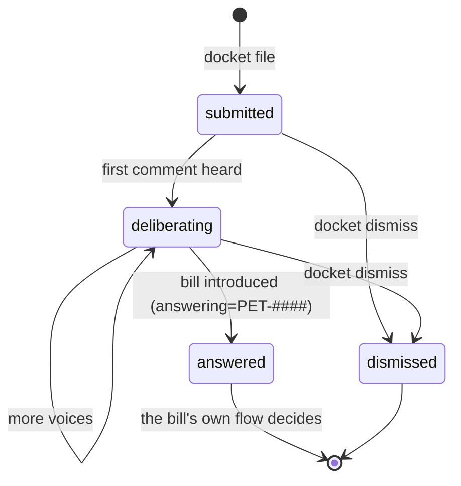

# Flow: petitions — the docket

A petition is how a wrong enters the institutions. In the fiction, the
docket is kept **by the institutions themselves** — the mechanical
archive (gogs) knows nothing of it. That is why petition machinery
writes to `matters.json` (institutional time), never to git.

## Domain

Anyone recognized by a city's registry may petition: a recognized
problem, a request, a dispute. The petition names a petitioner *of a
city* ("the fishers of Cogswich, through their legislator"). Once filed,
the grievance is **heard**: others speak on it, and the record grows.
A petition then has three fates:

- **answered** — a bill is introduced *answering* it (the usual road to
  legislation, see [legislation.md](legislation.md));
- **dismissed** — denied further hearing; the record remains;
- it may simply **stand** — open, deliberating, unanswered (a true state,
  not a failure).

What you need to file one: **a person** (a citizen of some city — the
petitioner acts through the chamber of their city) and **a grievance**
(a title; particulars optional). No office, no platform concepts.

## States



(The statuses are the matter store's; a petition answered by a bill is
carried by the bill's matter — see legislation.)

## Commands

```bash
export POLIS_PROVISIONED_SIM=my-sim-01      # the docket read is the sim's

# file — an ACT, needs a person and her city chamber
uv run polis docket file --as m.grimsbane --city cogswich \
  --title "The banks are being fished out" \
  --body  "Cogswich boats take everything; nothing for Brasshaven."
# → petition filed: PET-0001

# speak on it — also an act
uv run polis docket comment PET-0001 --as a.kettleblack --city cogswich \
  --body "Our creels come up empty since midwinter."

# read — NO identity needed (the record is public)
uv run polis docket list                     # all open petitions
uv run polis docket list --state all         # incl. dismissed/answered
uv run polis docket list --city brasshaven   # one city's
uv run polis docket show PET-0001            # full procedural record

# deny further hearing
uv run polis docket dismiss PET-0001 --as b.nightingale --city cogswich

# see the machinery instead of executing (works on every act)
uv run polis docket comment PET-0001 --as m.grimsbane --city cogswich \
  --body "…" --isomorphism
# ╭─ isomorphism — speak on petition PET-0001 ─╮
# │ 1. matters.json: append event (heard, m.grimsbane) to PET-0001
```

Note what `--isomorphism` shows: **no git command**. Petitions are
institutional time; the archive sees none of it. In phase 2 the same
command renders a platform API call instead.

## Where it lives

- `data/sims/<sim>/matters.json` (per sim) or `data/world/matters.json`
  (the shared world) — chosen by context: `POLIS_MATTERS_FILE` >
  `POLIS_PROVISIONED_SIM` > world.
- **Municipal dockets**: inside a city container, petitions go to the
  *city's own* docket — `data/sims/<sim>/dockets/<city>.json`, mounted
  rw as `POLIS_MATTERS_FILE`. Municipal grievances are the city's own
  record; the federal docket is the sim's. Both are host-inspectable.
- Matter events: `filed`, `heard`, `dismissed`, plus the bill-side events
  (`proposed`, `ratified`, …) that later close the petition.
- Code: `polis/matters.py` (the store), `polis/legislation/docket.py`
  (the Plans), `polis/cli/docket.py`.
