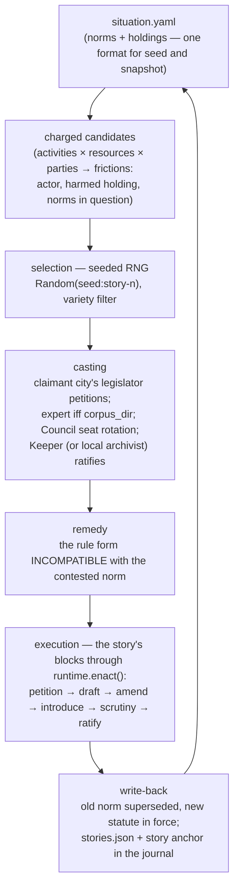

# Flow: the simulation — epochs played through the legal order

The director drives the three other flows. One drive step = one whole
**story**: from a friction in the world to an enacted (or failed) act —
cast, procedurally literate, deterministic.

## The loop



Determinism: one seed in `run.json`; every choice (selection, casting
rotation, remedy) derives from `Random(f"{seed}:{story-n}")`. Same seed +
same seed situation ⇒ same epoch. Failed and skipped stories are
recorded as first-class outcomes; when no charged candidates remain, the
director records a `skipped` story and stops — the situation is settled.

## What a story looks like

The `resource_dispute` template (the v1 arc) maps onto the flows:

| template block | what happens | flow |
|---|---|---|
| establish_traditional_use / introduce_competing_claim | observations in the journal | — |
| file_petition | `docket file` by the claimant city's legislator | [petitions](petitions.md) |
| assign_jurisdiction | observation (which norms are in question) | — |
| propose_legislation / amendment | `bill draft` + `amend` + `introduce --answering PET-####` | [legislation](legislation.md) |
| jurisdictional_review | expert scrutiny, or a recorded skip ("no federal expert exists for fisheries") | [legislation](legislation.md) |
| constitutional_review | Council jurist scrutiny (seat rotation) | [legislation](legislation.md) |
| approval / enactment | the Keeper ratifies; situation write-back | [legislation](legislation.md) + [archive](archive.md) |

Repeated remedies are not collisions: the second Quota Act is enacted as
"… (No. 2)" — the archive's git history never rolls back, even across
epochs.

## Commands

```bash
export POLIS_PROVISIONED_SIM=my-sim-01

uv run polis sim new --situation data/world/legal/norms/fisheries.yaml [--seed s]
uv run polis sim drive --steps 3      # or: sim tick (one story)
uv run polis sim stories              # story records: status, cast, matter
uv run polis sim present [--last 10]  # the narrated journal
uv run polis sim runtime              # norms in force, journal size

# epochs (the record's lifecycle)
uv run polis sim fresh --yes          # archive the record, start fresh
uv run polis sim epochs
uv run polis sim present --epoch <name>
```

### Intervening while the sim runs — scenario files (0034b)

You don't have to watch: write a Gherkin scenario and submit it to the
running sim. Beats are the shared vocabulary (`polis/sim/beats.py`), now
**scoped** (task 0059): submitted scenarios may use the `user` steps —
legal actions and in-world goals — while setup and operator-machinery
steps (`a provisioned sim …`, `the Mechanical Magistrate's CI is
erected`) belong to the test harness and are rejected at submission.
`uv run polis sim steps --scope user` lists the vocabulary (`--json` for
the UIs).

```bash
uv run polis sim submit my-story.feature   # validated against the user vocabulary
uv run polis sim scenarios                 # the scoreboard
uv run polis sim resume <slug>             # re-activate a paused scenario
```

```gherkin
Scenario: overfishing leads to a quota
  Given a petition of the fishers of brasshaven about the northern banks
  When the legislator drafts "Northern Banks Quota Act" into fisheries
  And the Keeper ratifies it with remedy "quota" superseding "N-0001"
  Then the archive main contains "Northern Banks Quota Act"
  And norm "N-0001" is superseded in the situation
```

Semantics: **omniscient narration** — beats execute in submission order,
whoever they name; the director services **one action beat per scenario
per drive step**, then continues its own seeded stories. Your
interventions change the situation, so the federation's next stories
react. Expectations become a scoreboard in the journal; a failed beat
**pauses** the scenario (never crashes the sim) until `sim resume`.

Reading the journal: every entry is one legal act with anchors into the
other clocks — `main: be343ae → f3c7208` (legal time), `matter: ACT-0004`
(institutional time), `situation: {superseded: …, in_force: …}` (the
norm transition). The `story` anchor closes each story with its bindings
(claimant/respondent/resource/contested norm/remedy/rng key) and cast.

**Acting manually inside a sim:** with `POLIS_PROVISIONED_SIM` set, the
chamber commands (`docket file`, `bill draft/amend/introduce/…`,
`archive obtain`) take the sim's slice, tokens and gogs automatically —
the same commands as in the flows above, no container needed. The working
clone defaults to `data/sims/<sim>/common-law` (run `archive obtain`
once to create it).

## Where it lives

- `data/sims/<sim>/`: `run.json` (jurisdiction + seed), `situation.yaml`
  (the evolving NormSet), `journal.jsonl`, `stories.json`,
  `matters.json`, `epochs/` — plus the machinery (`platform/`, `cities/`,
  `secrets.json`).
- The director runs **inside the operator container**
  (`polis-operator-<sim>`); the host CLI proxies. Execution goes through
  `runtime.enact()` — one call = one legal act = one journal entry; the
  sim never touches git stepwise.
- Code: `polis/sim/director.py` (the loop), `events.py` (frictions),
  `runtime.py` (the transaction facade), `journal.py` (records/epochs).
- Design: [../design/director.md](../design/director.md) — per-party
  selection policies (seeded/priority/scripted/interactive) are designed
  but only `seeded` is implemented.
